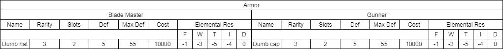
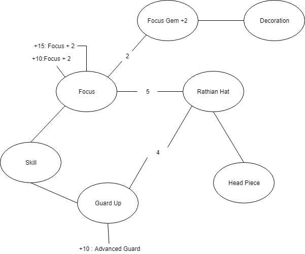
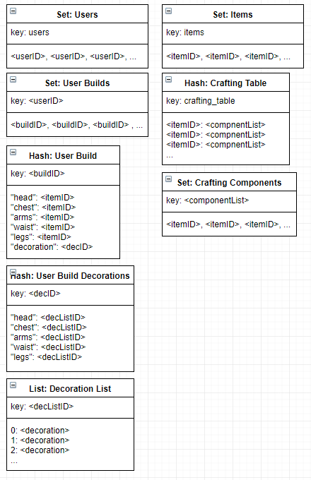

# BuildHunter
## Features
- Query for Individual Items
    - Includes information about
        - Drop rate
        - Gather locations
        - Which mosters drop them
- Search for Monsters
    - Retrieve information about monsters such as 
        - Weaknesses
        - Damage required for part break
- Look up Equipment and Gear (Weapons/Armor)
    - Will include
        - Attribute points obtained by wearing the gear
        - Available slots in the gear
        - Items required to craft
- Load / Store: Custom Gear Loadouts
    - Each loadout can be saved by an individual
    - Each loadout can be published 
    - Generates the materials required for crafting
    - Allows customization of decorations
    - Generates a list of skills obtained by the loadout
- Search published loadouts
    - Load published loadouts, change, and save them
- Query skills
    - Show how many and which attribute points are required to obtain a skill

## Tools

**Streaming Service**
- Kafka
    - Pub Sub service for writing to databases

**Databases**  
- Kasandra
    - Store Equipment and Weapons
    
- Neo4j
    - For build generation and skill querying
    
- Redis
    - Crafting and Consumable items
    - User made builds
    - Query builds
    
## Reach Goals
- Generate builds per skills desired
